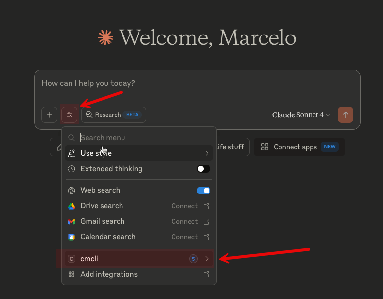
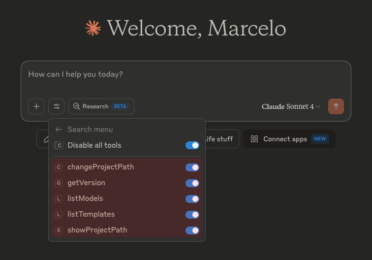

# Configure Claude

[<- Back](./README.md)&nbsp;&nbsp;&nbsp;|&nbsp;&nbsp;&nbsp;[Next ->](./try-your-first-chat.md)  

## Migration from Beta.13

**⚠️ Breaking Change:** Starting with Beta.14, the MCP server command has changed.

### Before (Beta.13)
```json
{
  "mcpServers": {
    "cmcli": {
      "command": "cm",
      "args": ["mcp-server", "--project-path", "/"]
    }
  }
}
```

### After (Beta.14)
```json
{
  "mcpServers": {
    "cmcli": {
      "command": "cm-mcp-server",
      "args": ["--project-path", "/"]
    }
  }
}
```

If you're upgrading from Beta.13, update your `claude_desktop_config.json` file with the new configuration above.

---

## Setting Up Claude (New Installation)

Setting up the CLI as an MCP server in claude is extremely simple.

1) Open up Claude Desktop (not the web version, but the actual app in your computer.)  If you don't have it, you can download it from [Anthropic directly](https://claude.ai/download).

2) Now need to edit the `claude_desktop_config.json` file and add our MCP server.

3) Locate the `claude_desktop_config.json` file in your system:
- If you are on Mac, the file should be located at `~/Library/Application Support/Claude/`
- If you are on Windows, the file should be located at `Users\[yourusername]\AppData\Roaming\Claude`
- If you can't find the file, check Anthropic's documentation for more information.

4) Open (with your favorite IDE or text editor) and update the `claude_desktop_config.json` file in your system.
>if it's empty, add this:
````json
{
  "mcpServers": {
    "cmcli": {
      "command": "cm-mcp-server",
      "args": ["--project-path", "/"]
    }
  }
}
````
> if it's not empty, add the following to your list of servers (after your last server):
````json
    "cmcli": {
      "command": "cm-mcp-server",  
      "args": ["--project-path", "/"]
    }
````

> For the project-path, you can keep it with / (Mac) or \ (Windows).  You'll change the project path later in the chat, once you create a project.

5) Save the file. Close Claude and restart it.

6) Start a new chat.  In the chat window, click on the servers / tools icon.



> You should see the new CMCLI tool listed at the bottom (if you have other serves, you'll see it along with those.)

7) Click on the CMCLI server, you should see a list of tools supported:



> Depending on the version of CLI you have, you may see more tools.

That's it!  You've verified that the tool is properly installed and ready to be used!  Now go [try your first chat](./try-your-first-chat.md) !

[<- Back](./README.md)&nbsp;&nbsp;&nbsp;|&nbsp;&nbsp;&nbsp;[Next ->](./try-your-first-chat.md)  